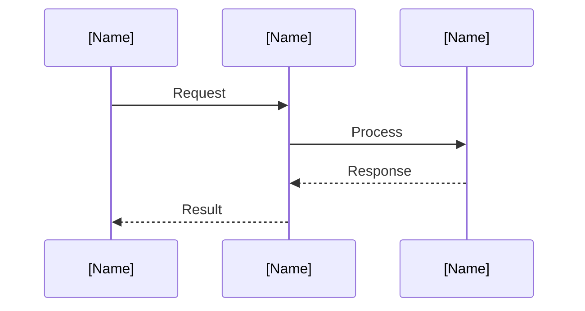

# Sequence diagram: [Flow name]

## Participants

| Role | System | Description |
|------|--------|-------------|
| | | |
| | | |

## Flow

## Error paths

| Failure point | Error | How surfaced | Recovery |
|---------------|-------|--------------|----------|
| | | | |
| | | | |

## Retry logic

| Step | Max retries | Backoff | Idempotent? |
|------|-------------|---------|-------------|
| | | | |

## Related

- Architecture:
- State machine:
- Runbook:
