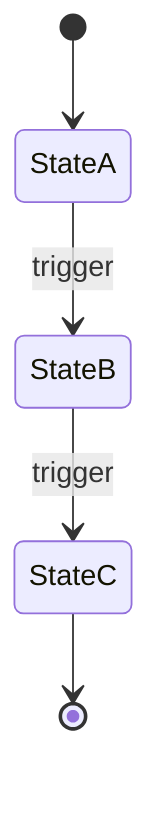

# State machine: [Entity name]

## States

| State | Meaning | Entry action | Exit action |
|-------|---------|-------------|-------------|
| | | | |
| | | | |

## Transitions

| From | To | Trigger | Condition | Side effect |
|------|----|---------|-----------|-------------|
| | | | | |
| | | | | |

## State diagram

## Error states

| Error state | How entered | Recovery path | Owner |
|-------------|-------------|---------------|-------|
| | | | |

## Retention / expiry

| State | Max time before action | Action |
|-------|------------------------|--------|
| | | |
| | | |

## Related

- Sequence diagram:
- Module spec:
- Runbook:
