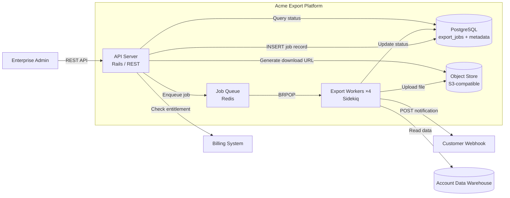

# Container diagram — Acme Export Platform

C4 Level 2 view. Shows the major system containers and their responsibilities.

## Container responsibilities

| Container | Language / runtime | Responsibility |
|-----------|-------------------|----------------|
| API Server | Ruby on Rails, Puma | Auth, validation, job creation, status queries |
| Job Queue | Redis (upstream), PG (persistence) | Fast enqueue/dequeue; durable record in PG |
| Export Workers | Ruby, Sidekiq workers | Query warehouse, transform to format, upload, notify |
| PostgreSQL (app) | 16.x | Job metadata, lease management, schedules |
| Object Store | S3-compatible (MinIO / AWS S3) | Export file storage (30-day retention) |

## Communication

| Source | Target | Protocol | Data |
|--------|--------|----------|------|
| API Server | Job Queue | Redis protocol | job_id, query parameters |
| API Server | PostgreSQL | PG wire | Job CRUD, schedule queries |
| Worker | Data Warehouse | PG wire (read-only, replica) | Query results (streamed) |
| Worker | Object Store | S3 HTTPS | Multipart file upload |
| Worker | Webhook | HTTPS POST | Status payload + download URL |

## Deployment notes

- API Server and Workers share no local state — both scale horizontally
- Queue requires Redis >= 7.x with persistence enabled
- Object Store must support presigned URLs for download
- Workers connect to a read replica, not the primary DW, to avoid query load on the source
