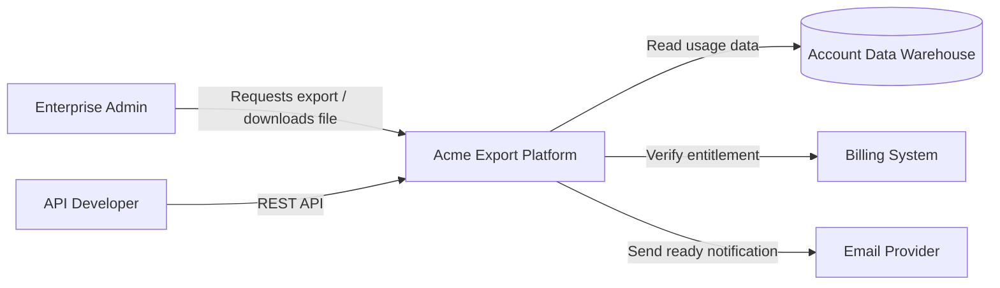

# System context — Acme Export Platform

C4 Level 1 style view for onboarding and shared orientation.

## Notes

- Billing is the entitlement source of truth for who may export.
- Warehouse access is read-only from the export workers.
- See [Container diagram](container-diagram.md) for the Level 2 view.
