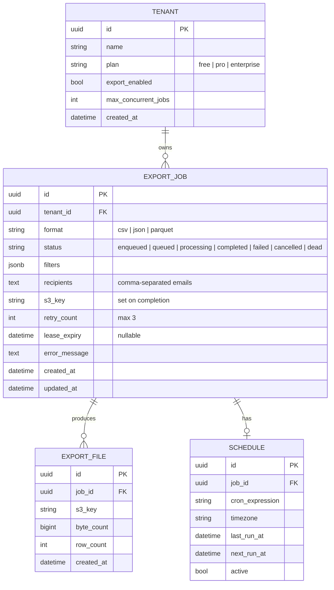

# Database schema

| | |
|--|--|
| **Domain** | Export job orchestration |
| **Primary store** | PostgreSQL 16 (RDS) |
| **Consistency** | Strong on job rows; eventual on analytics warehouse reads |

## Schema overview



## Key indexes

| Table | Index | Type | Why |
|-------|-------|------|-----|
| export_jobs | `(tenant_id, status, created_at)` | B-tree | List exports per tenant |
| export_jobs | `(status, lease_expiry)` | B-tree | Worker lease sweep (orphan recovery) |
| export_jobs | `(status, created_at)` | B-tree | Queue depth monitoring |
| export_jobs | `(schedule_id)` | B-tree | Recurring export lookups |
| export_files | `(job_id)` | B-tree | File list per job |

## Migration strategy

### Expand-contract pattern (adding a column)

Example: add a `priority` column to `export_jobs`.

```sql
-- Expand phase (v2.1 — deploy first, no code change yet)
ALTER TABLE export_jobs ADD COLUMN priority TEXT DEFAULT 'normal' NOT NULL;

-- Backfill (async job — no downtime)
UPDATE export_jobs SET priority = 'normal' WHERE priority IS NULL;

-- Contract phase (v2.2 — after all code reads `priority`)
-- No DDL needed; old default applies to historic rows
```

### Blue-green pattern (new table)

Example: introduce a `SCHEDULE` table for recurring exports.

1. Create table in current migration (safe — no code reads it yet).
2. Deploy code that reads `SCHEDULE` — old code ignores it.
3. Backfill rows from config or API.
4. Deprecate old schedule storage after one release cycle.

### Rollback

Every migration must have a rollback script:

```sql
-- Rollback: add priority column
ALTER TABLE export_jobs DROP COLUMN priority;

-- Rollback: remove schedule table
DROP TABLE IF EXISTS schedule CASCADE;
```

Rollback steps:
1. Deploy old code (which doesn't reference the new schema).
2. Run rollback DDL.
3. Verify query plans don't reference dropped objects.

## Row size estimates

| Table | Avg row bytes | Estimated rows | Total |
|-------|---------------|----------------|-------|
| export_jobs | ~400 | 5M (3 mo retention) | ~2 GB |
| export_files | ~200 | 5M | ~1 GB |
| schedule | ~150 | 10K | ~1.5 MB |

Archive export_jobs older than 90 days to cold storage per compliance policy. See `docs/internal/operations/archival/`.

## Related

- [Export service module spec](../services/export-service.md)
- [Export job state machine](../state-machines/export-job-lifecycle.md)
- [Sequence diagram: export processing](../sequence-diagrams/export-processing.md)
