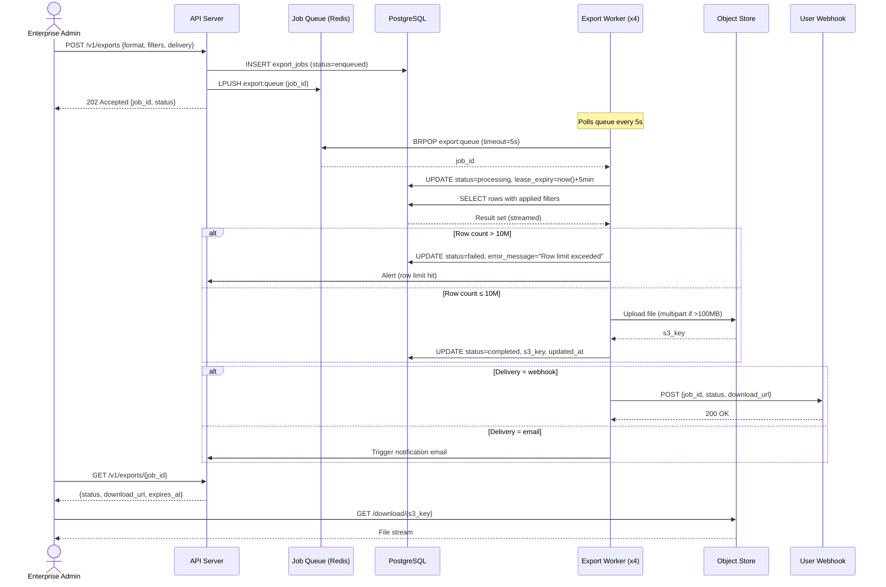
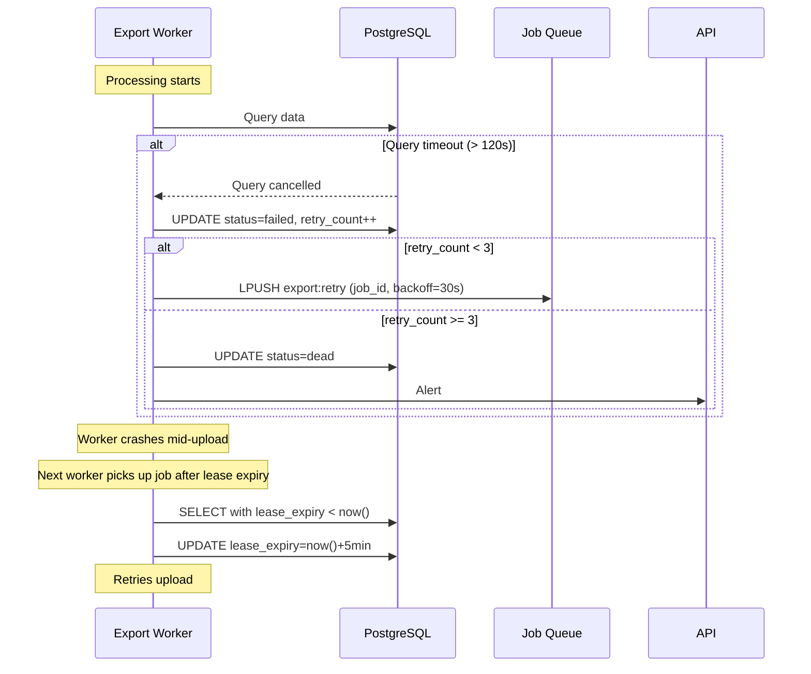

# Export processing sequence

**Flow:** API request → queue → worker → storage → notification

## Error paths

## Related

- [State machine: export job lifecycle](/examples/acme-export-platform/internal/system-design/state-machines/export-job-lifecycle/)
- [Export queue architecture](/examples/acme-export-platform/internal/system-design/export-queue-architecture/)
- [Runbook: queue backlog](/examples/acme-export-platform/internal/operations/runbooks/export-queue-backlog/)
