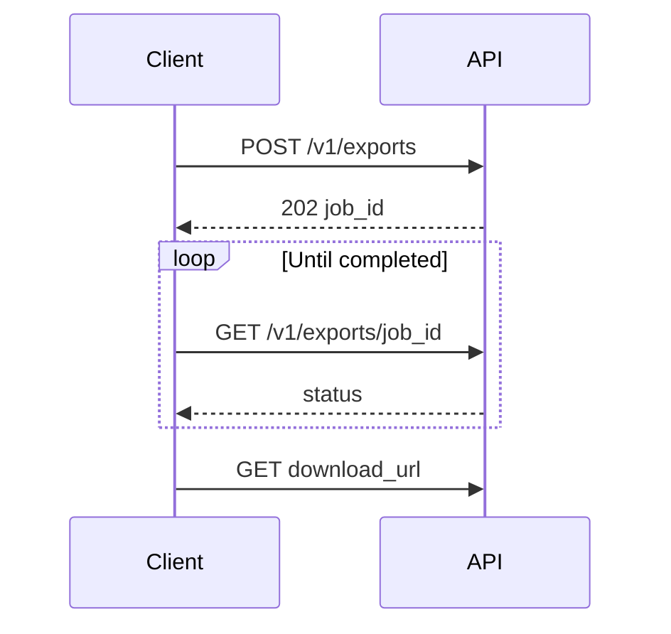

# Export API overview

Use the Export API to create export jobs and download results when ready.

> This page is **consumer-facing**. Internal annotations and worker details are intentionally omitted. Canonical contract: [`../../internal/system-design/api-specs/export-api.yaml`](../../internal/system-design/api-specs/export-api.yaml) (derive/curate; do not duplicate endpoint lists by hand).

## Authentication

Use a bearer access token with the `export:write` and `export:read` scopes.

```http
Authorization: Bearer <token>
```

## Mental model

1. `POST /v1/exports` creates a job and returns `202` with a `job_id`.
2. Poll `GET /v1/exports/{job_id}` until `status` is `completed` or `failed`.
3. Download via the `download_url` on completion (time-limited).



## Webhooks

Configure a webhook endpoint in the dashboard to receive `POST` notifications when exports complete or fail. Each payload carries a `job_id` and `status`.

See [tutorial: Schedule automated exports](/examples/acme-export-platform/user/tutorials/schedule-automated-exports/) for configuration steps.

## Errors (common)

| Code | Meaning | What to do |
|------|---------|------------|
| 401 | Missing/invalid token | Refresh auth |
| 403 | Entitlement missing | Check plan / admin role |
| 429 | Rate limited | Back off and retry |
| 422 | Invalid range invalid | Fix dates / format |

## Related

- Product quickstart: [../getting-started/quickstart.md](/examples/acme-export-platform/user/getting-started/quickstart/)
- Shared terms: [../../shared/glossary.md](/examples/acme-export-platform/shared/glossary/)
