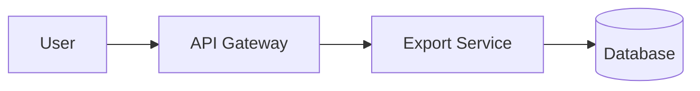

# Diagrams as code

Prefer **text diagrams** in Git for living engineering documentation. Diagrams that live outside the PR review cycle rot.

## Default: Mermaid

- Diffs and merges are readable
- Fits PR review — changed lines show exactly what moved
- Works in GitHub/GitLab and most SSGs
- AI tools generate it reliably
- CI can validate syntax and catch broken references

Use for: flows, sequences, state diagrams, simple C4 context/container graphs, decision trees.



### When Mermaid is not enough

Mermaid struggles with:
- Precise visual layout (diagrams where position carries meaning)
- Industry-specific icons (AWS, Azure, P&ID, Cisco, Kubernetes)
- Large or complex state machines with many transitions
- Polished visuals for executive presentations

For these cases, reach for draw.io (or equivalent).

## When to use draw.io

draw.io complements Mermaid rather than replacing it. Use draw.io when:

1. **Icon-heavy architecture** — AWS/GCP/Azure topology with service icons
2. **Precise layout** — Swimlanes, nested containers, floor plans, network racks
3. **Presentation quality** — Decks for exec review or customer-facing materials
4. **Non-standard shapes** — P&ID valves, electrical schematics, BPMN pools

### Dual-source pattern

Keep the source of truth in Mermaid for engineering docs. Export or redraw in draw.io only when a polished visual is needed:

```text
diagrams/
├── export-flow.mermaid   ← source of truth, validated in CI
└── export-flow.drawio    ← polished export, regenerated when source changes
```

Both checked into Git. The Mermaid file is the canonical version; the draw.io file exists for presentations.

## Before/after

**Before** — diagram lives in a whiteboard tool, last updated at design time:

```text
No diagram file in repo.
The architecture was drawn on a whiteboard in 2023 and photographed.
New engineers ask "is this still accurate?" — nobody knows.
```

**After** — architecture as code, updated in the same PR as the change:

```text
docs/internal/architecture/
├── context-diagram.mermaid    ← C4 Level 1, updated with system changes
├── container-diagram.mermaid   ← C4 Level 2, reviewed in every architecture PR
└── deployment-view.mermaid     ← Updated when infra changes
```

A PR that adds a new service includes the Mermaid changes in the same diff. Reviewers see exactly which boxes and arrows changed.

## Practice

- Store Mermaid in Markdown (or `.mmd` next to docs)
- Validate syntax in CI (the scaffold offers a commented Mermaid check)
- Render at site build time (MkDocs `mermaid2` plugin, Docusaurus native, or `mmdc` CLI)
- Update the diagram in the **same PR** as the architecture change

### CI validation

| Check | When | Command |
|-------|------|---------|
| Syntax | Every PR on Mermaid files | `npx @mermaid-js/mermaid-cli mmdc -i file.mmd` |
| Render | Site build | Built-in SSG plugin |
| Stale diagram alert | Weekly / monthly | Check `git log` on diagram files — flag if older than the surrounding code |

See also: [recipes/mermaid-in-ci.md](../recipes/mermaid-in-ci.md)
