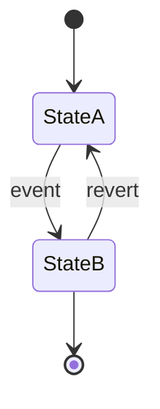

# State machine: [entity name]

> Starter stub. Replace with stateDiagram-v2 for each lifecycle entity.

## Diagram

## Transitions

| From | To | Trigger | Side effects |
|------|----|---------|--------------|
| StateA | StateB | event | |

## Error states

| State | Meaning | Recovery |
|-------|---------|----------|
| | | |
