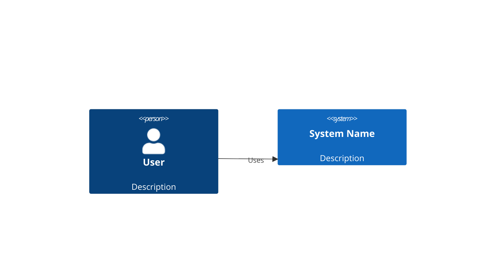
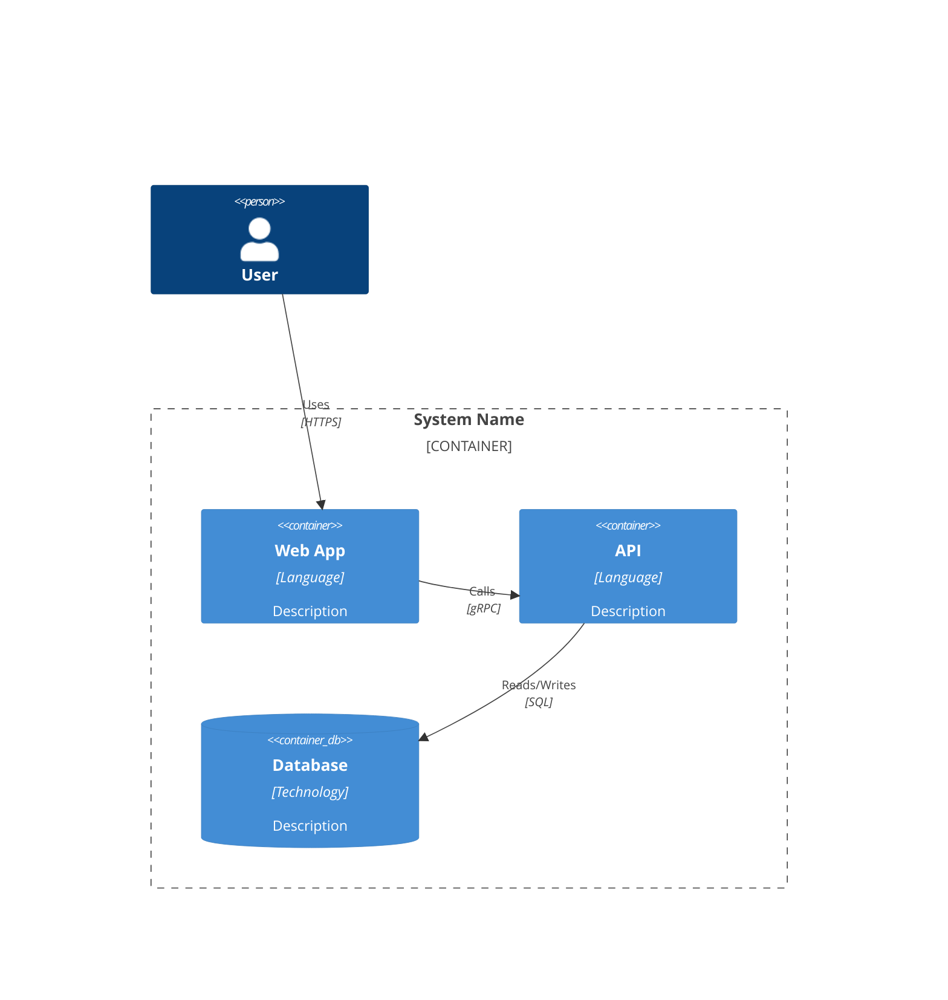

# Architecture overview (C4)

## Level 1 — System context

**Scope:** The system boundary. External actors and systems only.

**When to use:** Always. Every system needs a context diagram.

## Level 2 — Container diagram

**Scope:** The high-level technical building blocks (services, databases, queues, caches). Each deployable unit.

**When to use:** Always. The container view is the most useful single diagram for onboarding and operations.

## Level 3 — Component diagram

| Use Component diagram | Do NOT use Component diagram |
|---|---|
| Service has 3+ internal modules with distinct responsibilities | Single-module service with no internal structure |
| Complex orchestration logic worth documenting | Trivial CRUD wrapper |
| Component-level failure modes need explicit modelling | Internal structure is obvious from the code |

**One diagram per container that needs it.** Most containers do not need Level 3 in the docs.

## Decisions

Key architecture decisions should link to ADRs:

| Decision | ADR |
|----------|-----|
| | ADR-NNN |
| | ADR-NNN |

## Related

- ADRs: [`docs/internal/decisions/`](../docs/internal/decisions/)
- Cross-cutting concerns: [`templates/cross-cutting-concerns-checklist.md`](/templates/cross-cutting-concerns-checklist/)
- Sequence diagrams: [`templates/sequence-diagram-page.md`](/templates/sequence-diagram-page/)
